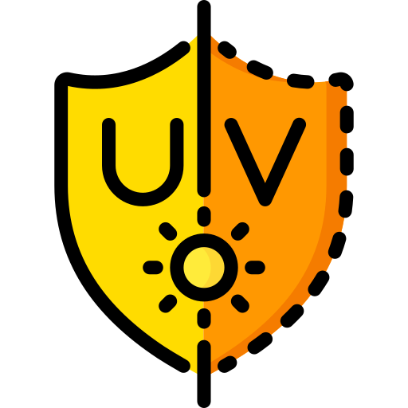

Icon used from <https://www.flaticon.com/>

# ioBroker.open_uv_index

Open UV Index integration to get sun UV report for your location.

**************************************************************************************************************

## Changelog
### **WORK IN PROGRESS**
* (Gerrit Eichel) - Adapted repository to new release workflow.
### 0.0.7 (2023-08-25)
* (Gerrit Eichel) - Skipped release due GitHub workflow / testing issues.

### 0.0.6 (2023-08-25)
* (Gerrit Eichel) - Added report of Ozone value.

### 0.0.5 (2022-06-21)
* (Gerrit Eichel) - Fixed adapter parameter issues which were causing warning messages.

### 0.0.4 (2022-06-18)
* (Gerrit Eichel) - Added feature to read and report local UV max time.

### 0.0.3 (2022-06-14)
* (Gerrit Eichel) - Adapter requests actual UV report every 15 minutes from 07:00 to 18:00.
* (Gerrit Eichel) - Fixed: Adapter sends to many requests reaching the free limitation of 50 requests per day.
* (Gerrit Eichel) - Added user notice for error "AxiosError: Request failed with status code 500".

### 0.0.2 (2022-06-12)
* (Gerrit Eichel) - Adapted adapter schedule times.
* (Gerrit Eichel) - Adapter requests actual UV report every 15 minutes from 06:00 to 21:00.

### 0.0.1 (2022-06-12)
* (Gerrit Eichel) - Initial release.

## License
MIT License

Copyright (c) 2022-2023 Gerrit Eichel <gerrit.eichel@web.de>

Permission is hereby granted, free of charge, to any person obtaining a copy
of this software and associated documentation files (the "Software"), to deal
in the Software without restriction, including without limitation the rights
to use, copy, modify, merge, publish, distribute, sublicense, and/or sell
copies of the Software, and to permit persons to whom the Software is
furnished to do so, subject to the following conditions:

The above copyright notice and this permission notice shall be included in all
copies or substantial portions of the Software.

THE SOFTWARE IS PROVIDED "AS IS", WITHOUT WARRANTY OF ANY KIND, EXPRESS OR
IMPLIED, INCLUDING BUT NOT LIMITED TO THE WARRANTIES OF MERCHANTABILITY,
FITNESS FOR A PARTICULAR PURPOSE AND NONINFRINGEMENT. IN NO EVENT SHALL THE
AUTHORS OR COPYRIGHT HOLDERS BE LIABLE FOR ANY CLAIM, DAMAGES OR OTHER
LIABILITY, WHETHER IN AN ACTION OF CONTRACT, TORT OR OTHERWISE, ARISING FROM,
OUT OF OR IN CONNECTION WITH THE SOFTWARE OR THE USE OR OTHER DEALINGS IN THE
SOFTWARE.